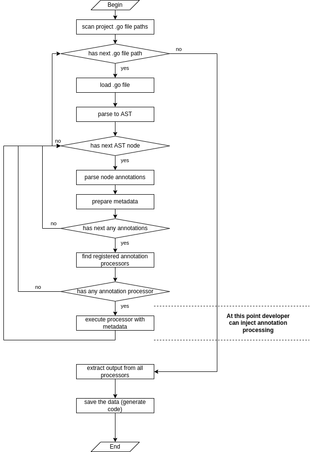

# go-annotation
go-annotation is a [Go programming language][golang] library to build a toolchain for code generation by annotated comments. 

# Go 1.18+

---

# Terms
**Annotation** - in the library scope annotation is a part of go comment that have syntax `@<annotation_name>{<field_name_1>="<field_value_1>, ..."}`. 
For example: `@Rest{method="GET", path="/api/v1/pet"}`, fields can be omitted: `@Mock`

**Annotation processor** - is a client code that implements [_**pkg.AnnotationProcessor**_](https://github.com/YReshetko/go-annotation/blob/master/pkg/registry.go#L29) interface which receives parsed annotations along with _**ast.Node**_ metadata. 

# Principals
Approximate high level processing is shown on schema:



In case of any error during processing the annotation processing will panic.

# Usage

In general, developer needs to pass next steps for implementing generator:

- Define annotation(s)
- Implement annotation processor(s)
- Prepare entry point to register annotation(s) and annotation processor(s)
- Build generation tool or use it from source code 

### Custom annotation definition

First of all we need to define a go structure that represents particular annotation in code. Let's take `@Rest` as an example:
`@Rest{method="GET", path="/api/v1/pet"}`. Then corresponding structure would look like

```go
type Rest struct {
	Method string `annotation:"name=method,default=GET"`
	Path   string `annotation:"name=path,default=/"`
}
```
As you can see the structure is defined along with `annotation` tag that have next parameters:
- **name** - defines a filed name in annotation
- **default** - defines a default value if it's missing in annotation
- **required** - boolean parameter that defines if annotation field must be defined by user. This parameter has no value: `annotation:"name=field,required"`.

### Register annotation processors
`./pkg` package provides the library API that allows developers inject logic into annotation processing. There are defined next types:

- `type Annotation any` - represents a custom annotation in library
- `type AnnotationProcessor interface` - represents a custom annotation processor
- `type Node interface` - the base entity that sent to annotation processor during processing. From the entity developer can receive prefilled structures that represent annotations along with `ast.Node` and node metadata such as: fo file, module root, imports and search functionality 

There is also exported function to register annotation processor: `Register[T Annotation](processor AnnotationProcessor)`

So, if developer has structure that represents an annotation and annotation processor, then this can be registered next way:

```go
annotation.Register[Rest](&Processor{})
```

### Running 

Obviously, code should be generated prior compile application stage. That means the generator should be standalone tool that runs at any time when developer needs the generated code.
So, developer has to defined main function:

```go
func main() {
	// pre-processing stage (if required)
	pkg.Process()
	// post-processing stage (if required)
}
```

Running processing:
```shell
 go run cmd/main.go path/to/project/root
```

First argument of the application is path to project root. Starting from this folder the processor will pass root and all subfolders recursively and find all .go files to processing.

So, minimal possible tool definition would look like:
```
tool
├── cmd
│   └── main.go
└── internal
    ├── annotation.go
    └── processor.go
```

**annotation.go**
```go
type SomeAnnotationStructure struct {}
```

**processor.go**
```go
import (
	annotation "github.com/YReshetko/go-annotation/pkg"
)

func init() {
	annotation.Register[SomeAnnotationStructure](&SomeAnnotationProcessor{})
}


var _ annotation.AnnotationProcessor = (*SomeAnnotationProcessor)(nil)

type SomeAnnotationProcessor struct {}

func (p *SomeAnnotationProcessor) Process(_ annotation.Node) error {
    // Single node processing
}

func (p *SomeAnnotationProcessor) Output() map[string][]byte {
    // Prepare processing results and return:
    // map.key (string) - relative file path (module root is a base path) (for example: /internal/handler/rest.gen.go)
    // map.value ([]byte) - resulting file data (for example .go file)
}

func (p *SomeAnnotationProcessor) Version() string {
    return "0.0.1" // any string, that represents the processor version
}

func (p *SomeAnnotationProcessor) Name() string {
    // Any string that represents the processor name, 
    //if the processor handles a single annotation it could be the annotation name
    return "SomeAnnotationStructure" 
}
```

**main.go**
```go
package main

import (
	_ "github.com/repo/tool/internal" 
	"github.com/YReshetko/go-annotation/pkg"
)

func main() {
	pkg.Process()
}
```

### Library API
At the moment the `annotation.Node` contain only one search method: `FindImportByAlias(alias string) (string, bool)` that helps to find related import to type/function.
To make the library more efficient this API will be extended.

Apart from that, there are some util functions that help to work with library (also will be extended in future):

`FindAnnotations[T any](a []Annotation) []T` - helps to find exact annotations in list of all annotations:
```go
func (p *SomeAnnotationProcessor) Process(node annotation.Node) error {
	annotations := annotation.FindAnnotations[SomeAnnotationStructure](node.Annotations())
	if len(annotations) == 0 {
		return nil
	}
	...
}
```

`CastNode[T ast.Node](n Node) (T, bool) ` - helps to cast incoming `annotation.Node` to particular `ast.Node`:
```go

func (p *SomeAnnotationProcessor) Process(node annotation.Node) error {
    ...
    n, ok := annotation.CastNode[*ast.TypeSpec](node)
    if !ok {
        return fmt.Errorf("unable to create constructor fot %t: should be ast.TypeSpec", node.Node())
    }
	...
}

```

More examples you can find in [annotations](./annotations) and [examples](./examples)

# Benefits

- The library can help orchestrate code generation for a project. Instead of building multiple tools that scans project AST in different ways developers can encapsulate required functionality in annotation.
- Several annotations can be processed by the same entities that helps to build code generation ecosystem
- Library itself allows to scan module dependencies and preload external projects AST that extends variability of the annotation usage
- Annotations and code generation itself allows to save time on routine coding  

# Inspiration

- [Java annotations](https://en.wikipedia.org/wiki/Java_annotation)  
- Go framework - [github](https://github.com/MarcGrol/golangAnnotations), [blog](https://xebia.com/blog/the-use-of-annotations-boosts-our-productivity-in-golang/) 
